# jetpack-compose-demo

Jetpack Compose Demo, applied along with Navigation, Dagger Hilt, BottomNavbar, SplashScreen, Nested NavController, Lottie, Online Image Loader etc.

This demo is built to target as a Jetpack Compose reference project on its first Beta version (1.0.0-beta05)

___

## Jetpack Compose Version: 1.0.0-beta05

## Screenshots

Splash Screen

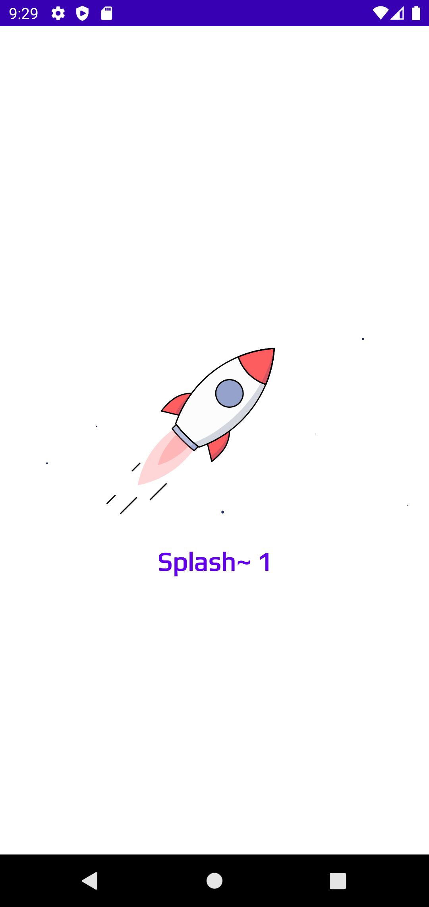

Default Material Theme     |  Customised Theme 1       |  Customised Theme 2      |
:-------------------------:|:-------------------------:|:-------------------------:
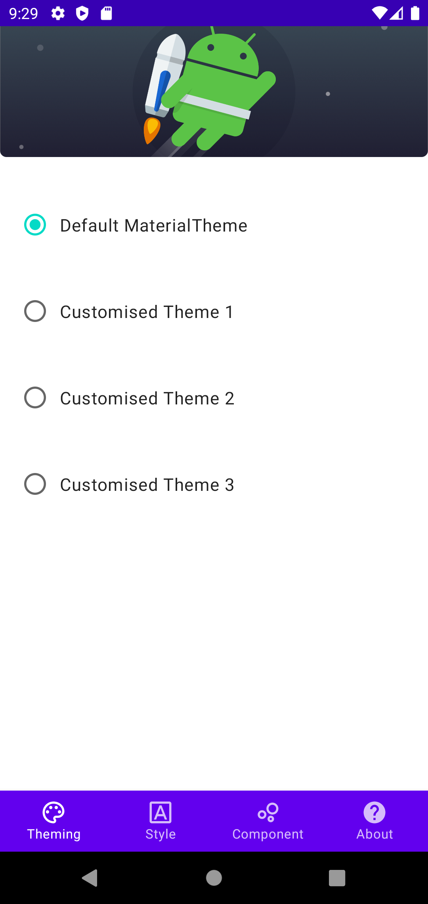  |  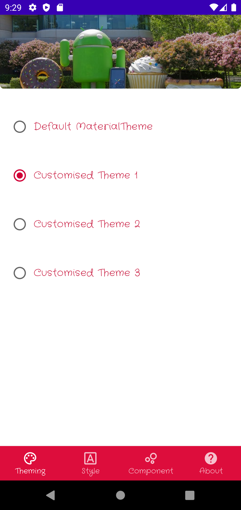 | 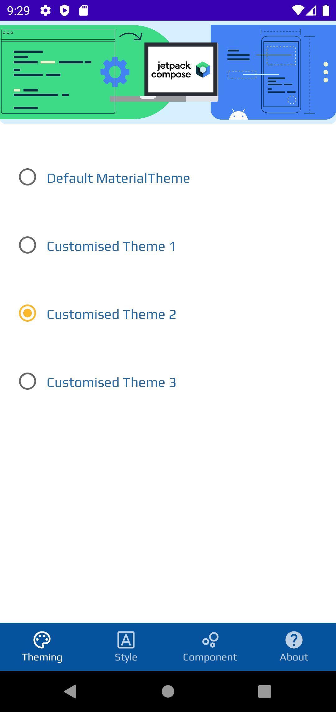 |
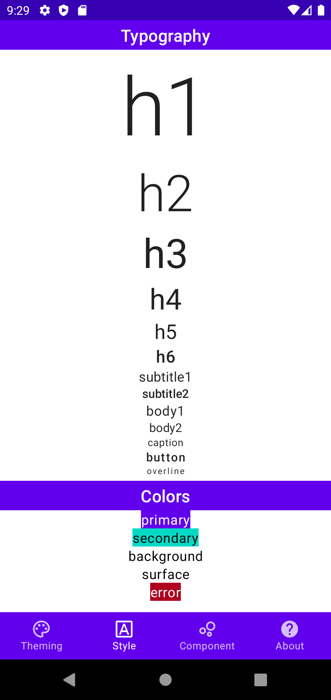  |  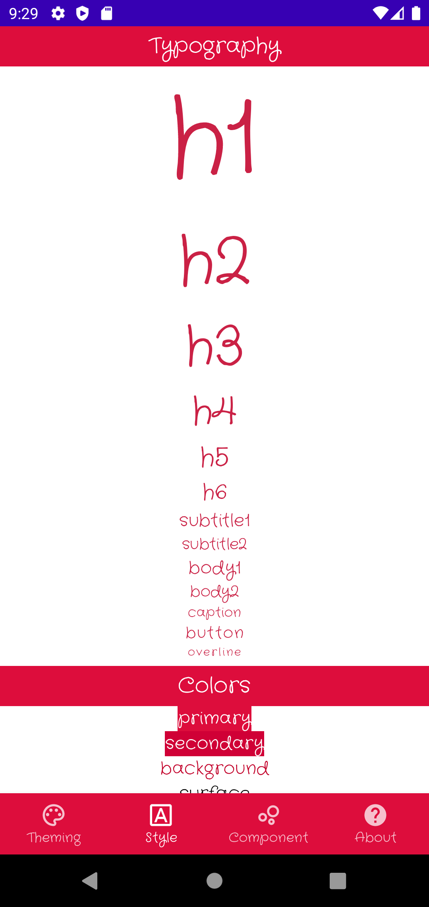 | 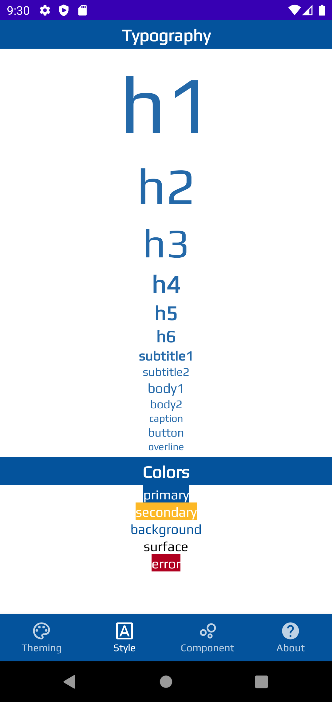 |
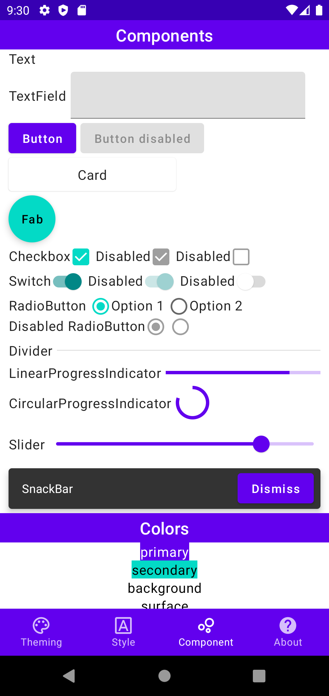  |  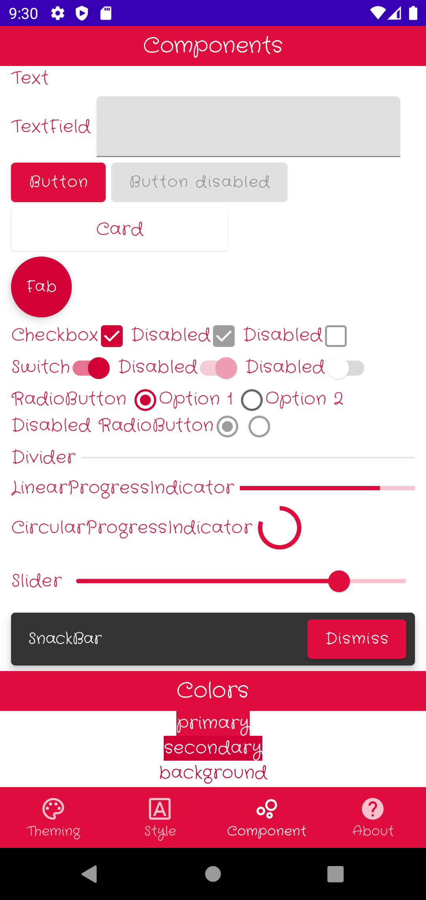 | 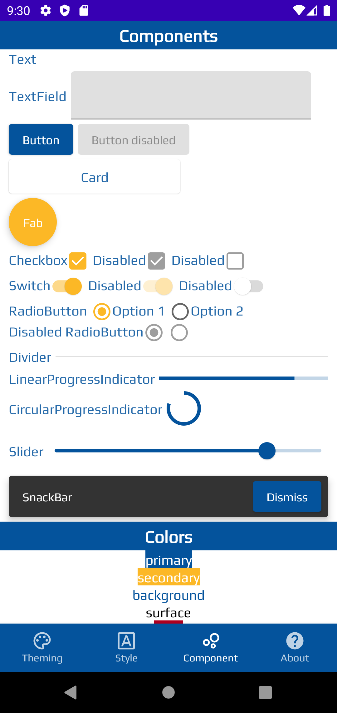 |

Online image loading with loading animation(Lottie)

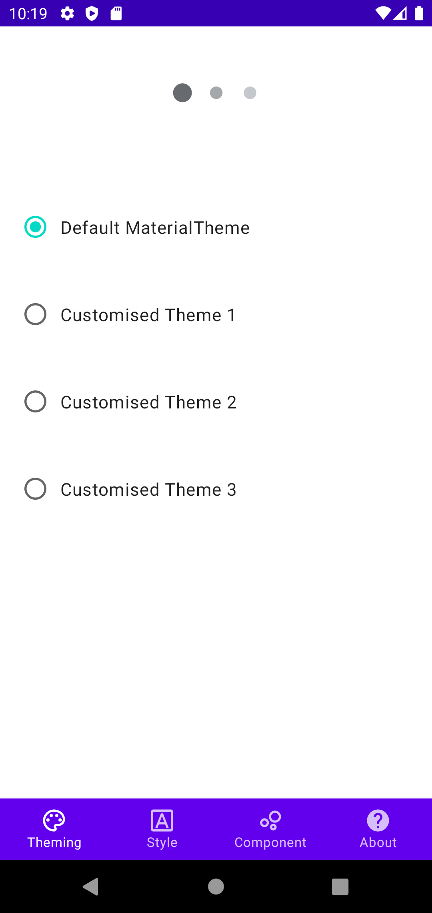

## Interest points:

#### Jetpack Navigation - Compose

[package view.navigation](https://github.com/hongwei-bai/jetpack-compose-demo/tree/main/app/src/main/java/com/hongwei/jetpack_compose_demo/view/navigation)

___

#### Hilt

##### How to inject view model into a Composable?

[SplashScreen.kt](https://github.com/hongwei-bai/jetpack-compose-demo/blob/main/app/src/main/java/com/hongwei/jetpack_compose_demo/view/splash/SplashScreen.kt)

```kotlin
val viewModel = hiltNavGraphViewModel<SplashViewModel>()
```

```kotlin
@HiltViewModel
class SplashViewModel @Inject constructor() : ViewModel()
```

Also in [MainScreens.kt](https://github.com/hongwei-bai/jetpack-compose-demo/blob/main/app/src/main/java/com/hongwei/jetpack_compose_demo/view/screens/MainScreen.kt)

___

#### Image loading Library - Coil

[Banner.kt](https://github.com/hongwei-bai/jetpack-compose-demo/blob/main/app/src/main/java/com/hongwei/jetpack_compose_demo/view/components/Banner.kt)

```kotlin
val painter = rememberCoilPainter(
    request = url,
    fadeIn = true
)

when (painter.loadState) {
    is ImageLoadState.Success -> Image(
        painter = painter,
        contentScale = ContentScale.Crop,
        contentDescription = null,
        modifier = Modifier
            .height(120.dp)
            .fillMaxWidth()
            .clip(RoundedCornerShape(bottomStart = 6.dp, bottomEnd = 6.dp))
            .shadow(10.dp)
    )
    ImageLoadState.Loading -> LoadingDots()
    else -> LoadingDots()
}
```

___

#### Lottie

[SplashScreen.kt](https://github.com/hongwei-bai/jetpack-compose-demo/blob/main/app/src/main/java/com/hongwei/jetpack_compose_demo/view/splash/SplashScreen.kt)

```kotlin
val animationSpec = remember { LottieAnimationSpec.RawRes(R.raw.anim_splash) }
val state = LottieAnimationState(
    isPlaying = true,
    repeatCount = Integer.MAX_VALUE,
    enableMergePaths = false
)
LottieAnimation(
    spec = animationSpec,
    animationState = state
)
```

[Banner.kt](https://github.com/hongwei-bai/jetpack-compose-demo/blob/main/app/src/main/java/com/hongwei/jetpack_compose_demo/view/components/Banner.kt)

___

#### Splash Screen

##### Key is to remove splash screen from navigation backstack:

```kotlin
navController.navigate("main") {
    popUpTo("splash") { inclusive = true }
    launchSingleTop = true
}
```

Sometimes might need manually import:

```kotlin
import androidx.navigation.compose.popUpTo
```

[SplashScreen.kt](https://github.com/hongwei-bai/jetpack-compose-demo/blob/main/app/src/main/java/com/hongwei/jetpack_compose_demo/view/splash/SplashScreen.kt)

___

#### Nested Navigation

##### Top level navigation:

- Splash Screen &#8594; Main Screens

##### Secondary level navigation:

- Four tabs in main screens: Theming, Style, Component as well as About.

___

#### Bottom Navigation Bar

[MainScreens.kt](https://github.com/hongwei-bai/jetpack-compose-demo/blob/main/app/src/main/java/com/hongwei/jetpack_compose_demo/view/screens/MainScreen.kt)

[BottomNavBar.kt](https://github.com/hongwei-bai/jetpack-compose-demo/blob/main/app/src/main/java/com/hongwei/jetpack_compose_demo/view/navigation/BottomNavBar.kt)

```kotlin
Scaffold(
    bottomBar = { BottomNavBar(navController) }
) {
    // Content
}
```

___

#### Dynamic Theming

```kotlin
DemoTheme(viewModel.theme.observeAsState().value) {
    Scaffold(
        bottomBar = { BottomNavBar(navController) }
    ) {
        MainNavCompose(navController)
    }
}
```

[MainScreens.kt](https://github.com/hongwei-bai/jetpack-compose-demo/blob/main/app/src/main/java/com/hongwei/jetpack_compose_demo/view/screens/MainScreen.kt)

```kotlin
@Composable
fun DemoTheme(
    theme: ThemeEntity?,
    darkTheme: Boolean = isSystemInDarkTheme(),
    content: @Composable () -> Unit
) {
    MaterialTheme(
        typography = typography,
        colors = lightColors(
            primary = Color(theme.colorPrimary),
            onPrimary = Color(theme.colorOnPrimary),
            // ...
        ),
        content = content
    )
}
```

[DemoTheme.kt](https://github.com/hongwei-bai/jetpack-compose-demo/blob/main/app/src/main/java/com/hongwei/jetpack_compose_demo/view/theme/DemoTheme.kt)

___

#### Customised Themes with Colors, Typography

[package view.theme](https://github.com/hongwei-bai/jetpack-compose-demo/blob/main/app/src/main/java/com/hongwei/jetpack_compose_demo/view/theme)

___

#### How to use download fonts via Android Studio

##### Customised fonts used in this demo:

- DemoTypographyCraftyGirls
  
- DemoTypographyPlay

[DemoTheme.kt](https://github.com/hongwei-bai/jetpack-compose-demo/blob/main/app/src/main/java/com/hongwei/jetpack_compose_demo/view/theme/DemoTheme.kt)

[res/font](https://github.com/hongwei-bai/jetpack-compose-demo/tree/main/app/src/main/res/font)

___

## Minor interests - Libraries under this section are adopted in the project, but may not strongly bond to Jetpack Compose, so I will list them, but separately from other major ones.

- Jetpack Rooms

- ViewModel Compose

- Kotlin Coroutines

___

## Learning Materials:

- [Jetpack Compose Official Tutorials with content on left sidebar](https://developer.android.com/jetpack/compose/documentation)

- [Playground](https://foso.github.io/Jetpack-Compose-Playground/material/textfield/)

- [Tell you what is the counterpart in Jetpack](https://www.jetpackcompose.app/What-is-the-equivalent-of-RadioGroup-in-Jetpack-Compose)

___

## Thanks

While myself leaning Jetpack Compose, I find it is sometime difficult to find helpful samples, especially when you are looking for ones using a combination of Compose with some other existing popular libraries.

I hope this demo could be helpful in these context.

I will list all libraries I adopted in this demo along with Jetpack Compose, so that you can quickly find out whether or not this demo is helpful to you.

Other than that, I will also list a few learning materials I went through myself which possibly helpful to you too.

Last but not least, I will list all links to what you may interest in, for quick reference.

Please let me know if you have any questions or suggestions.

Thanks!

Hongwei
